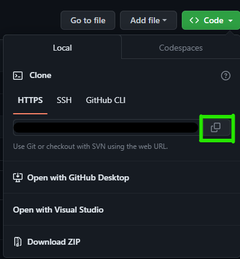
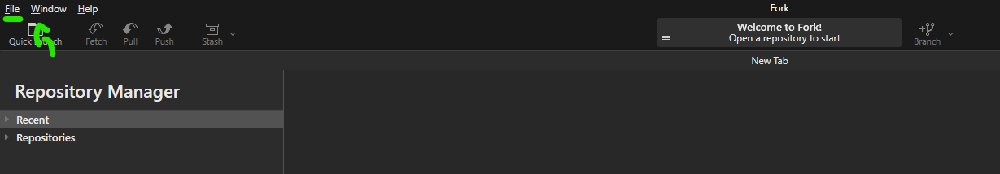
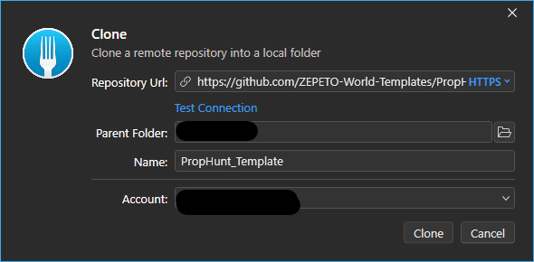
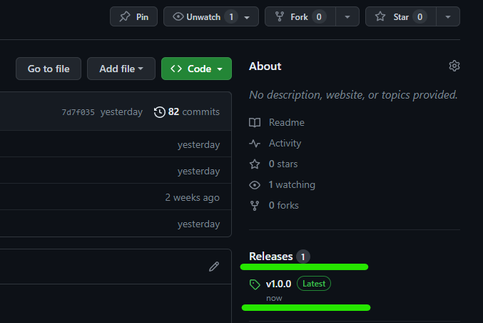

# Find a pair game

## 📢 About

Nice to meet you Creators! 👋 Welcome to Runner template guide!

With Runner you can create amazing worlds to play with your friends!

Now, are you ready to start?

  

## ❓ How to create with Runner template

:wrench: Installation and settings

- If you haven't install the Zepeto World you can check how to do it <a href="https://docs.zepeto.me/studio/reference/installation_and_settings">Here!</a>

- Once you have installed Zepeto, you have to pull this repository and you can do it in 3 ways
  - [Cloning it](#cloning-the-project)
  - [Downloading it](#downloading-the-project)
  - [By Unitypackage](#getting-it-from-the-releases-section)

### Cloning the project

First we go to the [Code] button and click it.

 </img> 

Then click on the icon to copy the link of the repository (make sure that you are on the https tab) or copy it manually.

 </img> 

Once you have it, using your your preferred software (in this case we are using <a href="https://git-fork.com/" target="_blank"> Fork</a>) click on "File->Clone" or press "Ctrl + N" to clone.

 </img> 

Here we fill the URL tab and set the folder where you want to save it and press clone.

 </img> 

Once it clones the project you can open it from unity hub.

### Downloading the project

Click on the same [Code] button but instead of clicking on the link, click on download zip

 </img> 

Then extract the files and open it with unity.

### Getting it from the releases section

Go to the releases section or click in the lastest release

 </img> 

Then click on the file ".unitypackage" and import it in a new project of Unity!

 </img> 

  

> 💡 Enjoy and start creating with the Template! :tada:

  

## 🔨 Tools

**GameManager**
The GameManager shows the basic settings for the game

| Variable                 | Utility                                                    |
| ------------------------ | ---------------------------------------------------------- |
| Stage Customization      | Reference to the Stage of the mannequin                    |
| Stage Runway             | Reference to the Stage of the Runway                       |
| Stage Winner             | Reference to the Stage of the Winner                       |
| Time To Start            | Sets the time to start the game when all players are ready |
| Vote Timer Limit         | Sets the time limit of the vote state                      |
| Customization Time Limit | Sets the time limit of the customization state             |

 </img> 

**UIManager**
The ui manager has a list that contains all the panels of the different states of the game.

 </img> 

**Mutliplayer Manager**
This class is included into the multiplay component of the <a href="https://github.com/JasperGame/zepeto-modules"> Module importer</a> you can learn more about multiplayer <a href="https://docs.zepeto.me/studio/reference/multiplay">here</a>.

 </img> 
 </img> 

**Player Spawner**
This class only has the reference of where the player should be in certain moment of the game.
In this case it has a reference of where the player will be in the mannequin state.
 </img> 

**Clothing Manager**
This class has the list of items for each part of the body that will be created on the game.
To create one you will need the itemId of the item that you want to create in the game and write that id on the correct list by the part of the body.
 </img> 

**UI Prefabs**
You can edit every panel of each part of the game from their own prefab.
You can found them in the project folder.
 </img> 

