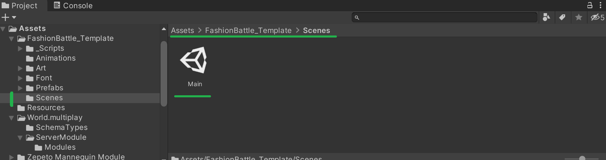
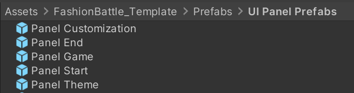

# Fashion Battle Template

## 📢 About

Nice to meet you Creators! 👋 Welcome to Fashion Battle guide!  

With Fashion Battle you can create amazing worlds to play with your friends!  

Now, are you ready to start?  

## Overview

In this game, players dress according to a random theme and walk down a runway to rate/vote for the best outfit.  
Once the lobby has enough players, the stage loads. All players enter the scenario, and a random theme is selected.
Players dress up using costumes from their inventory following the theme before the end of the dress-up time.
After all players have walked the runway, a voting button appears below them.
The player with the most votes wins.  

  

## ❓ How to create with Fashion Battle Template

:wrench: Installation and settings

- If you haven't install the Zepeto World you can check how to do it <a href="https://docs.zepeto.me/studio/reference/installation_and_settings">Here!</a>

- Once you have installed Zepeto, you have to pull this repository and you can do it in 3 ways
  - [Cloning it](#cloning-the-project)
  - [Downloading it](#downloading-the-project)
  - [By Unitypackage](#getting-it-from-the-releases-section)

### Cloning the project

First we go to the [Code] button and click it.

 </img> 

Then click on the icon to copy the link of the repository (make sure that you are on the https tab) or copy it manually.

 </img> 

Once you have it, using your your preferred software (in this case we are using <a href="https://git-fork.com/" target="_blank"> Fork</a>) click on "File->Clone" or press "Ctrl + N" to clone.

 </img> 

Here we fill the URL tab and set the folder where you want to save it and press clone.

 </img> 

Once it clones the project you can open it from Unity Hub.  

### Downloading the project

Click on the same [Code] button but instead of clicking on the link, click on download zip

 </img> 

Then extract the files and open it with Unity.  

### Getting it from the releases section

Go to the releases section or click in the latest release.

 </img> 

Then click on the file ".unitypackage" and import it in a new project of Unity!

 </img> 

> 💡 Enjoy and start creating with the Template! :tada:
 

## ❓ FAQ

 
 <h3>How to open the project</h3> 

Select the template folder and it will open the project.
 </img>

 
 To open a Unity project for the first time, follow these steps:

1. Launch Unity Hub.
2. In Unity Hub, click on the "Projects" tab on the left side.
3. Click on Add: If your project is not already listed, click on the "Add" button to add your project to the list. Navigate to the folder where your Unity project is located and select the folder. Click "Open" to add the project to Unity Hub.
4. Select Project: Once your project is added to the list, click on it to select it.
5. Wait for Unity to Load: Unity will now open your project. This may take some time depending on the size of your project and your computer's performance.
6. Project Opened: Once Unity has finished loading, your project will be opened and ready for you to work on.

 
 <h3>How to play</h3> 
 
Before you press play to test the template you have to open the scene and start the server.  
 </img>  

 
 To play the game template in Unity, follow these steps: 

1. Open the Scene: First find the scene in the next folder and open it.
 </img>  
2. Start the Server: Then first press the [Start Server Button(green)]
 </img> 
3.  Play the Template: then you can press [Play] to test the template.

**Multiplay Server Button:**
- Server Button On
</img> 

- Server Button Off
</img>

 

<h3> How to change variables</h3> 
 

To make changes in the game you can go in the Hierarchy and select the "Managers" folder there are the most customizables settings for the template.

 </img>
To change variables in Unity, follow these steps:

1. Open the Hierarchy: In the Unity Editor, locate and click on the "Hierarchy" tab at the top of the screen.
2. Select the "Managers" Folder: In the Hierarchy window, find and click on the "Managers" folder. This folder contains the most customizable settings for the template.
3. Modify Variables:  With the "Managers" folder selected, you can now modify the variables and settings for the template as needed.
4. Save Changes: After making your changes, remember to save the scene by clicking on "File" > "Save Scene" in the Unity Editor.

 

<h3> World multiplay component missing</h3> 
 

If you have an error showing that some component is missing, you have to go to the project/packages folder and find the ZEPETO.World folder, then right click it and press in Reimport, it will took some time to fix that problem.

 </img>
To fix the "World multiplay component missing" error in Unity, follow these steps:

1. Locate the ZEPETO.World Folder: In your Unity project, navigate to the project/packages folder.
2. Find the ZEPETO.World Folder: Inside the packages folder, locate the ZEPETO.World folder.
3. Reimport the ZEPETO.World Package:
  - Right-click on the ZEPETO.World folder and select "Reimport" from the context menu.  - Unity will reimport the ZEPETO.World package, which may take some time.
 - Wait for Unity to finish reimporting the package.
4. Check for Errors: After reimporting, check if the "World multiplay component missing" error is resolved.
5. Save Changes: Save your project to ensure that the changes are applied.

  

## 🔨 Tools

 
 <h3>GameManager </h3> 
 

The GameManager shows the basic settings for the game

| Variable                 | Utility                                                    |
| ------------------------ | ---------------------------------------------------------- |
| Stage Customization      | Reference to the Stage of the mannequin                    |
| Stage Runway             | Reference to the Stage of the Runway                       |
| Stage Winner             | Reference to the Stage of the Winner                       |
| Time To Start            | Sets the time to start the game when all players are ready |
| Vote Timer Limit         | Sets the time limit of the vote state                      |
| Customization Time Limit | Sets the time limit of the customization state             |

 
</img>
  

 
 <h3>UIManager</h3>
 
The UI manager has a list that contains all the panels of the different states of the game.
 
</img>
  

 
 <h3>Multiplayer Manager</h3>
 
This class is included into the multiplay component of the <a href="https://github.com/JasperGame/zepeto-modules"> Module importer</a> you can learn more about multiplayer <a href="https://docs.zepeto.me/studio/reference/multiplay">here</a>.
 
</img>
  
</img>
  

 
 <h3>Player Spawner</h3> 
 
This class only has the reference of where the player should be in certain moment of the game.
In this case it has a reference of where the player will be in the mannequin state.
 </img>  

 
 <h3>Clothing Manager</h3>
 
This class has the list of items for each part of the body that will be created on the game.
To create one you will need the itemId of the item that you want to create in the game and write that id on the correct list by the part of the body.
 </img>  

 
 <h3>UI Prefabs</h3>
 
You can edit every panel of each part of the game from their own prefab.
You can found them in the project folder.
 </img>  

 
 <h3>Themes Names</h3>
 
You can edit the list of names and the number of random Themes.
(Remember to change the number of themes in the "SyncPlayerDataModule")
 </img> 
 </img> 

  

## :point_right: You can easily modify this:

<h3>GameManager </h3>

1. Select the GameObject in your scene that has the GameManager script attached to it.
2. In the Inspector window, you should now see the GameManager component with the variables listed.
3. Locate the variables you want to modify:
    - Time To Start
    - Vote Timer Limit
    - Customization Time Limit
4. To modify a variable, simply click on the value next to the variable name and enter the new value.
 </img>  

<h3>Clothing Manager</h3>

1. Select the GameObject in your scene that has the Clothing Manager script attached to it.
2. In the Inspector window, you should now see the Clothing Manager component with the list of items for each body part.
3. Click on the list you want to add items to (e.g., Head Items)
4. Click on the "Size" field to specify the number of items in the list.
5. For each item in the list, click on the element (e.g., Element 0), and then enter the item's ID in the field that appears. You will need the itemId of the item that you want to create.
6. Repeat the process for each list and item you want to add.

That's it! You've now added items to the list in the Unity inspector for the Clothing Manager class.

<h3>UI Prefabs</h3>
You can edit every panel of each part of the game from their own prefab.
You can found them in the project folder.
 </img>  

   To modify UI prefabs in Unity, follow these steps:
1. Locate the UI prefab you want to modify. You can find prefabs in the project folder under the "Prefabs" directory or in a specific folder for UI elements.
2. Double-click on the UI prefab to open it in the Prefab Editor.
3. In the Prefab Editor, you can modify the UI elements as needed. This may include changing text, images, layouts, or adding/removing components.
4. Once you have made your modifications, save the prefab by clicking the "Apply" button in the Prefab Editor.
5. To apply the changes to instances of the prefab in your scene, select each instance and click the "Apply" button in the Inspector window.
6. Test your changes in Play mode to ensure they work as expected.
7. If you need to make further modifications, repeat the above steps.

That's it! You've now modified a UI prefab in Unity.

<h3>Themes Names</h3>
You can edit the list of names and the number of random Themes.

**List of themes**
1. Select the GameObject in your scene that has the Themes Names script attached to it.
2. In the Inspector window, find the Themes Names component.
3. Locate the variables you want to modify: Themes: This is a list of strings representing the names of themes.
4. For each theme in the list, click on the element (e.g., Element 0), and then enter the theme's name in the field that appears.
5. (Remember to change the number of themes in the "SyncPlayerDataModule")
 </img> 

**Number themes**
1. Locate the Project tab at the bottom of the Unity editor window. If you can't find it, go to the top menu and click on "Window" > "General" > "Project".
2. Click on the Project tab to open the Project section in the Unity editor. In the Project section, you can browse and manage your project's assets, such as scripts, scenes, textures, and models.
3.
Option A:

   - In Assets, locate the "World.multiplay" folder and open it.
   - Locate the "ServerModule" folder and open it.
   - Inside the "ServerModule" folder, find the "Modules" folder and open it.
   - Within the "Modules" folder, locate the "SyncPlayerDataModule" script and open it.

Option B:

  - You can also use the search bar at the top of the Project section to quickly find assets by name. Search for the "SyncPlayerDataModule" file and click to open it.

4 Inside the "SyncPlayerDataModule" script, find the variable called "ThemeAmount” and modify its value as needed.
5. Save the "SyncPlayerDataModule" script.

> Verify that the number of themes in the "SyncPlayerDataModule" script matches the number of elements in the array in the "MultiplayerManager" script. If not, adjust the number of themes in the "SyncPlayerDataModule" script accordingly.

 </img> 

